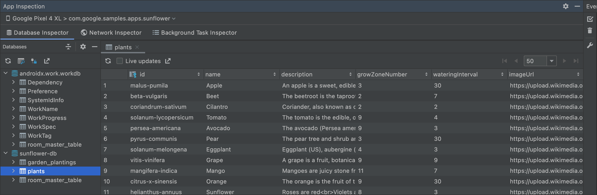

# Error: Hooks can only be called inside the body of a function component. 
if see error: Hooks can only be called inside the body of a function component. just run the following command in the root folder of the repo.
npm link ./examples/ReactNativeApp/node_modules/react

# Debug APP:
- Execute the following command to start the app in debug mode:
```npx react-native start --reset-cache --experimental-debugger```

- Select j

# View Sqlite DB
Follow this article: https://developer.android.com/studio/inspect/database?hl=en

## Open the Database Inspector
To open a database in the Database Inspector, do the following:

- Run your app on an emulator or connected device running API level 26 or higher.

>Note: A known issue related to the Android 11 emulator causes apps to crash when connecting to the Database Inspector. To fix the issue, follow these steps.
From the menu bar, select View > Tool Windows > App Inspection.

- Select the Database Inspector tab.

- Select the running app process from the menu.

- The databases in the currently running app appear in the Databases pane. Expand the node for the database that you want to inspect.

## View and modify data
The Databases pane displays a list of the databases in your app and the tables that each database contains. Double-click a table name to display its data in the inspector window to the right, shown in figure 1. Click a column header to sort the data in the inspector window by that column.

Figure 1. The Database Inspector window.



To modify data in a table, follow these steps:

Double-click a cell.
Type a new value.
Press Enter.
If your app uses Room and your UI observes the database, such as with LiveData or Flow, then any changes you make to the data are immediately visible in your running app. Otherwise, changes are only visible the next time your app reads the modified data from the database.